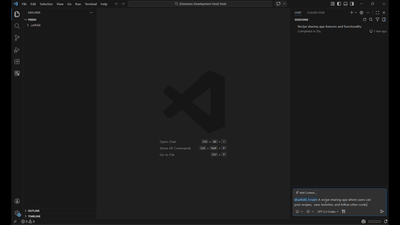
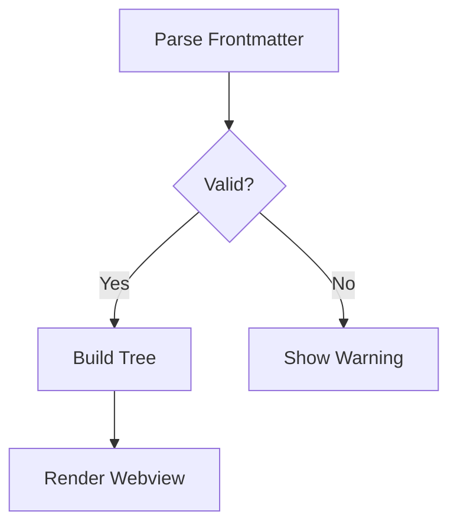

# Unfold

**Hierarchical plans as markdown files. Git-native. AI-powered. Human-readable.**

Unfold turns plain markdown files into navigable, multi-level project plans — right inside VS Code. Plans are version-controlled, diffable, and editable by any tool. The `@unfold` chat participant generates plans from natural language using your workspace as context.

[](media/unfold-demo.gif)

## Why Unfold?

Most planning tools lock your plans in a SaaS database. Unfold keeps them where your code lives — in your repo, as markdown.

- **AI generates, you own** — `@unfold /create` builds a full plan from a sentence. The output is plain files you control.
- **Any editor, any tool** — Plans are just `.md` with YAML frontmatter. Edit them in VS Code, Vim, or a GitHub PR review.
- **See the big picture** — A sidebar tree shows your entire plan hierarchy. Click any node to read the full section with syntax highlighting and Mermaid diagrams.
- **Track progress** — Status indicators (`not-started` → `in-progress` → `complete` → `blocked`) on every node.

---

## Features

### Tree View
A dedicated sidebar shows your plan as an interactive tree. Nodes display status icons and are organized by parent-child relationships with sort ordering.

### Rich Webview
Click any node to render its markdown body with:
- Syntax-highlighted code blocks (via highlight.js)
- Mermaid diagrams (flowcharts, sequence, gantt, state, ER, class, journey)
- Breadcrumb navigation for nested sections
- Automatic VS Code theme sync (dark/light/high contrast)

### AI Plan Generation (`@unfold`)
The built-in chat participant analyzes your workspace before generating:

| Command | What it does |
|---------|-------------|
| `@unfold /create` | Generate a new plan from a description |
| `@unfold /convert` | Convert a Copilot, Claude, or text outline into Unfold format |
| `@unfold /refine` | Expand, restructure, or add detail to an existing plan |

The AI uses four workspace tools — project structure, file reading, code search, and dependency analysis — to make plans context-aware.

### Live Updates
A debounced file watcher detects changes to any `.md` file and refreshes the tree instantly. Edit a plan file in one tab and see the tree update in real time.

---

## Getting Started

### 1. Install

Search for **Unfold** in the VS Code Extensions Marketplace, or install from a `.vsix`:

```bash
code --install-extension unfold-0.2.0.vsix
```

### 2. Create Your First Plan

Open VS Code Chat (`Ctrl+L`) and type:

```
@unfold /create Build a REST API with user auth, CRUD endpoints, and PostgreSQL
```

Unfold generates a structured plan as markdown files in your workspace.

### 3. Explore

Click the **Unfold** icon in the Activity Bar to see the plan tree. Click any node to read its details in the webview panel.

---

## Plan File Format

Each `.md` file has YAML frontmatter validated at runtime with Zod:

```yaml
---
id: "user-auth"              # Unique identifier
title: "Implement User Auth"  # Display name in tree
level: 2                      # 1=Context, 2=Workflow, 3=Detail, 4=Code
status: "not-started"         # not-started | in-progress | complete | blocked
parent: "api-project"         # Parent node's id (empty for root)
order: 1                      # Sort position among siblings
icon: "shield"                # Optional: VS Code codicon or fa:name
---

## Overview
Implement JWT-based authentication with refresh tokens...
```

### Hierarchy Levels

| Level | Purpose | Default Icon | Example |
|-------|---------|-------------|---------|
| 1 — Context | Project overview, goals, constraints | `cube` | "E-commerce Platform Rebuild" |
| 2 — Workflow | Major phases or workstreams | `git-branch` | "Backend API Development" |
| 3 — Detail | Specific tasks and implementation notes | `symbol-method` | "Design User Schema" |
| 4 — Code | Implementation details, pseudocode | `code` | "JWT Middleware Implementation" |

### Directory Convention

```
my-project/
  plan.md                      # Root plan (Level 1)
  steps/
    01-backend.md              # Phase (Level 2)
    02-frontend.md
    backend/
      01-auth.md               # Task (Level 3)
      02-database.md
    frontend/
      01-components.md
  components/
    01/
      01-detail.md             # Implementation (Level 4)
```

### Custom Icons

Use VS Code [Codicons](https://code.visualstudio.com/api/references/icons-in-labels) or FontAwesome-style names:

```yaml
icon: "database"        # VS Code codicon
icon: "$(rocket)"       # Codicon with $() syntax
icon: "fa:flask"        # FontAwesome style (auto-mapped to codicon)
```

---

## Settings

| Setting | Default | Description |
|---------|---------|-------------|
| `unfold.guidanceLevel` | `balanced` | How much the AI elaborates: `precise` · `guided` · `balanced` · `creative` |
| `unfold.stepDetailLevel` | `standard` | Detail per step: `concise` · `standard` · `detailed` · `comprehensive` |
| `unfold.askBeforeGenerating` | `true` | Whether the AI asks clarifying questions before generating |

---

## Commands

| Command | Description |
|---------|-------------|
| Unfold: Refresh Plan Tree | Manually refresh the tree view |
| Unfold: Collapse All | Collapse all tree nodes |
| Unfold: Open Section | Open a section in the webview |
| Unfold: Open Source File | Open the raw `.md` file in the editor |
| Unfold: Show Warnings | Display Zod validation warnings |

---

## Mermaid Diagrams

Embed diagrams directly in plan files:

````markdown

````

Supported types: flowchart, sequence, gantt, state, ER, class, and journey diagrams. Theme auto-syncs with VS Code.

---

## Links and Navigation

Markdown links between plan files navigate within the webview with breadcrumb trails:

```markdown
See [Authentication Setup](steps/backend/01-auth.md) for details.
```

Links to non-plan files open in the VS Code editor.

---

## Development

```bash
npm install              # Install dependencies
npm run compile          # Build with esbuild
npm run watch            # Watch mode
npm run lint             # ESLint
```

Press `F5` to launch the Extension Development Host. The `sample-plan/` and `cocktail-sample-plan/` directories contain example plans.

---

## License

MIT
