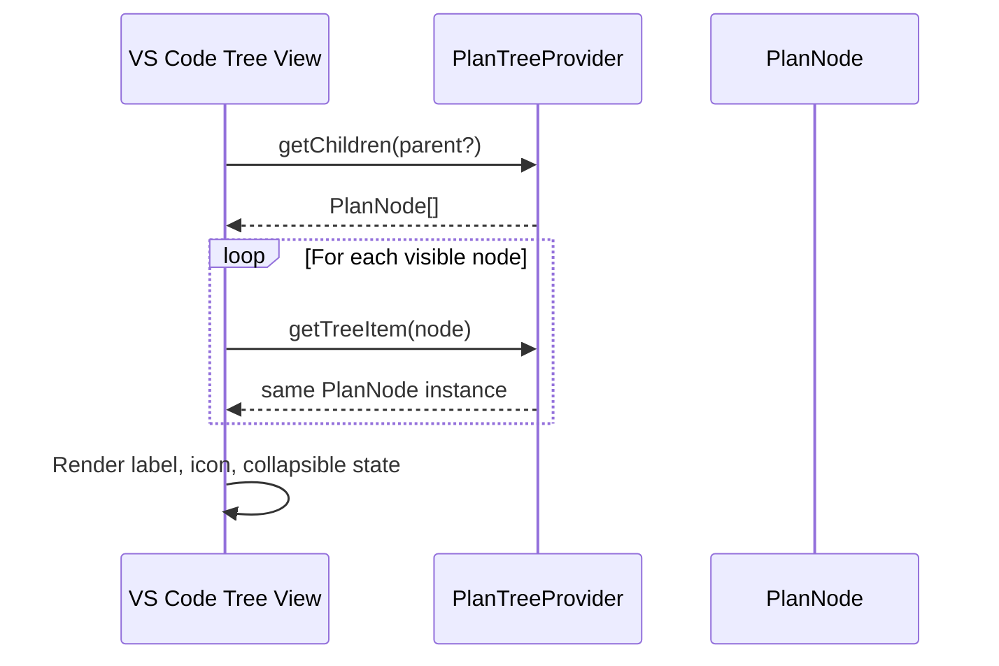

# getTreeItem Implementation

## Code

```typescript
getTreeItem(element: PlanNode): TreeItem {
  return element;
}
```

## Explanation
- `PlanNode` already extends `TreeItem`, so no mapping or object construction is required.
- Returning the same instance preserves:
  - identity (`id`, `label`, metadata)
  - state (`collapsibleState`, command, tooltip)
  - UI consistency (the same node object is reused by VS Code)
- This keeps `getTreeItem` intentionally lightweight; all visual/configuration logic belongs in the `PlanNode` constructor and helpers.

## Execution Flow



## Responsibility Boundary


## Why This Design
- **Single source of truth**: display properties are initialized once in `PlanNode`.
- **No duplication**: avoids rebuilding `TreeItem` fields on every render call.
- **Predictable behavior**: reduces drift between model and UI.
- **Easy to evolve**: future icon/status logic stays isolated in `PlanNode`.

## Edge Cases
- If a malformed node is passed, the provider still returns it; validation should happen during parse/model creation, not in `getTreeItem`.
- If lazy decoration is needed later (e.g., dynamic badges), it can be added by mutating the node before returning, without changing the method contract.

## Complexity
O(1) - Constant-time identity return (no allocation)

## Verification Checklist
- [x] `getTreeItem` returns the same object reference it receives.
- [x] Tree labels/icons come from `PlanNode` configuration.
- [x] Expand/collapse behavior matches node `collapsibleState`.
- [x] No additional object allocation occurs per call.

## Test Cases
- [x] Returns the same PlanNode instance
- [x] VS Code renders the item correctly
