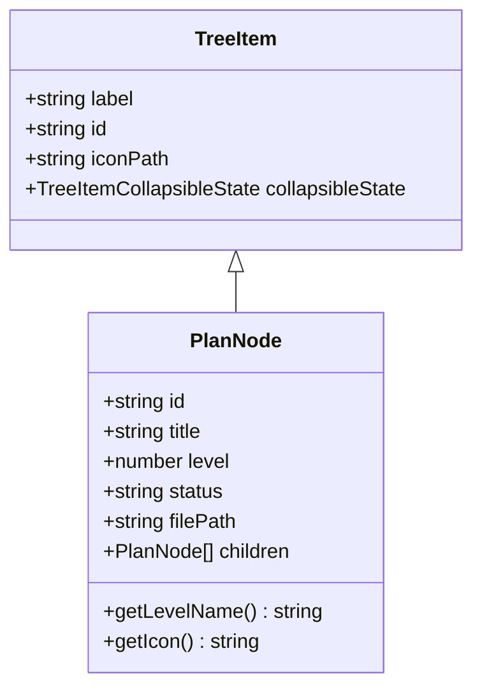

# PlanNode Model

## Context
PlanNode extends VS Code's TreeItem to represent each node in the plan hierarchy.

## Detail

### Class Structure

### Status Icons
- `not-started` → Circle outline
- `in-progress` → Filled circle
- `complete` → Green checkmark
- `blocked` → Red X

### Level Icons
- Level 1 (Context) → Cube
- Level 2 (Workflow) → Git branch
- Level 3 (Detail) → Method symbol
- Level 4 (Code) → Code symbol

## Dependencies
- Step 03: Build Tree View

## Acceptance Criteria
- [x] Extends TreeItem
- [x] Stores all frontmatter data
- [x] Provides dynamic icons
