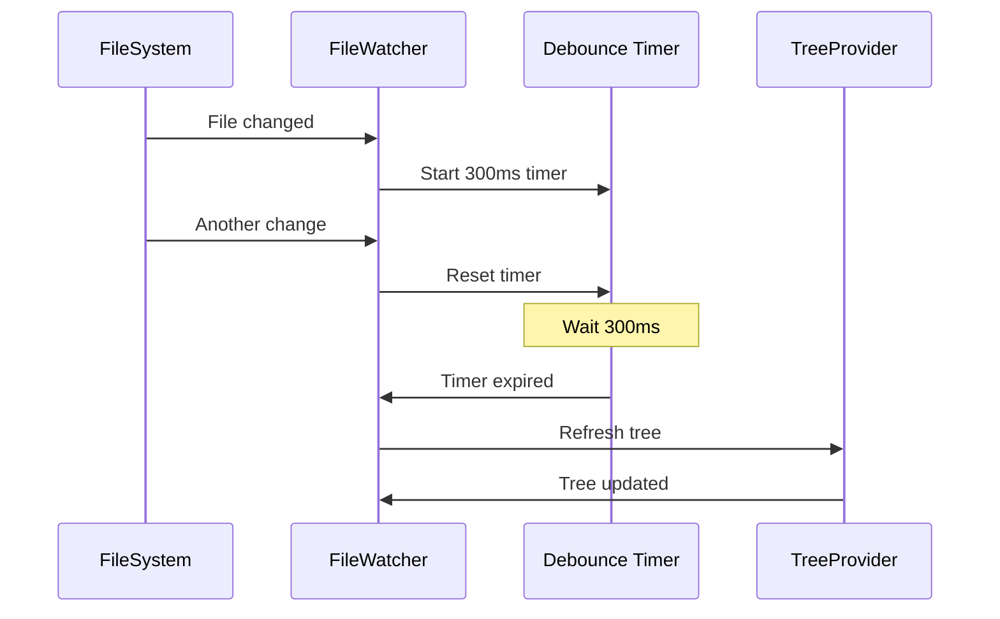

# FileWatcher Component

## Context
Watches the workspace for markdown file changes and triggers tree refresh.

## Detail

### Debounce Strategy

### Events Handled
- `onDidChange` - File content modified
- `onDidCreate` - New file added
- `onDidDelete` - File removed

## Dependencies
- Step 03: Build Tree View

## Acceptance Criteria
- [x] Watches all .md files in workspace
- [x] Debounces rapid changes
- [x] Triggers tree refresh
