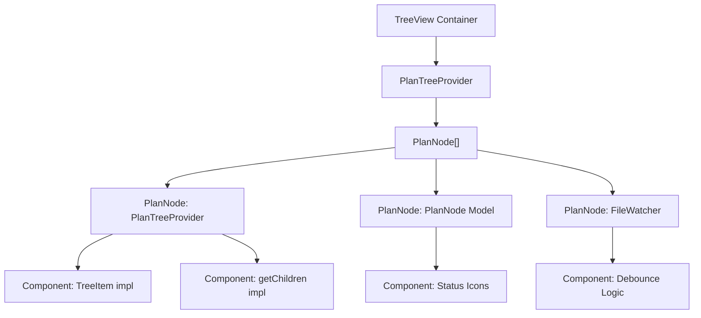

## Context
Display the parsed plan hierarchy in a VS Code sidebar TreeView.

## Component Hierarchy

## Workflow
- Implement `PlanTreeProvider` extending `TreeDataProvider`
- Register TreeView in `package.json` contribution points
- Add level-appropriate icons (context, workflow, detail, code)
- Add status-colored decorations
- Implement file watcher for live updates

## Sub-Components
See component details:
- [PlanTreeProvider Implementation](../components/01/01-plan-tree-provider.md)
- [PlanNode Model](../components/01/02-plan-node-model.md)
- [FileWatcher](../components/02/01-file-watcher.md)

## Dependencies
- Step 02: Parser must be functional

## Acceptance Criteria
- [x] Tree view appears in sidebar
- [x] Nodes display correct icons based on level
- [x] Status is visually indicated
- [x] Tree updates when files change
- [x] Hierarchical drilldown works (4 levels)
- [ ] Collapse all functionality works
